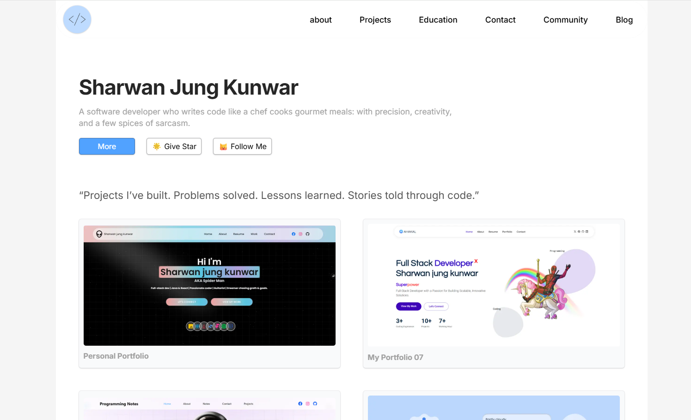

# 👋 Hi, I'm Sharwan Kunwar  

## 🌐 Socials:
    

## 💬 Can Communicate  

   

# 💻 Tech Stack and Tools:

## 🛠 About Me  
I'm a **full-stack developer** passionate about building robust, scalable, and interactive applications. I enjoy working with both backend and frontend technologies, solving complex problems, and experimenting with new tools and frameworks. My journey in software development is fueled by curiosity and a desire to create impactful solutions that deliver real value.

## 🔥 Currently Working On  
 

📌 Check out my portfolio:  
### **📥 [My Portfolio](https://sharwankunwar.github.io/My-Portfolio-07/)**  

---

## 🚀 Interests & Goals  
- 🔥 Building full-stack web and mobile applications  
- 💡 Learning and implementing **microservices architecture**  
- 🚀 Exploring **React** and **Node.js** for frontend and backend development  
- 💻 Contributing to **open-source projects**  

## 🤝 Collaboration & Open-Source  
- 🚀 Always open to **collaborating on projects**  
- 🔍 Looking for **exciting problem-solving challenges**  
- 💬 Feel free to **reach out** if you have an interesting idea!

## 📫 How to Reach Me  
- 📩 Email: **sharwankunwar07@gmail.com**  
- 💼 LinkedIn: **[---]**  
- 🐦 Twitter: **[---]**  

---

### ✍️ Random Dev Quote

---

🔹 **Constantly improving, always coding, and pushing boundaries!** 🚀  
Thanks for visiting! Stay tuned for more exciting projects! 🚀
